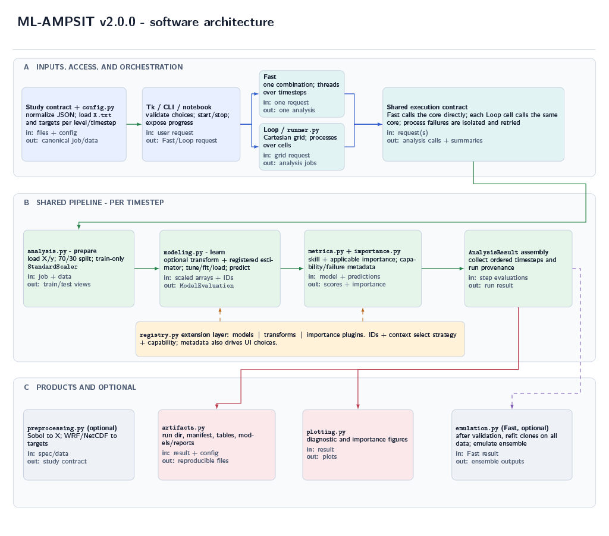
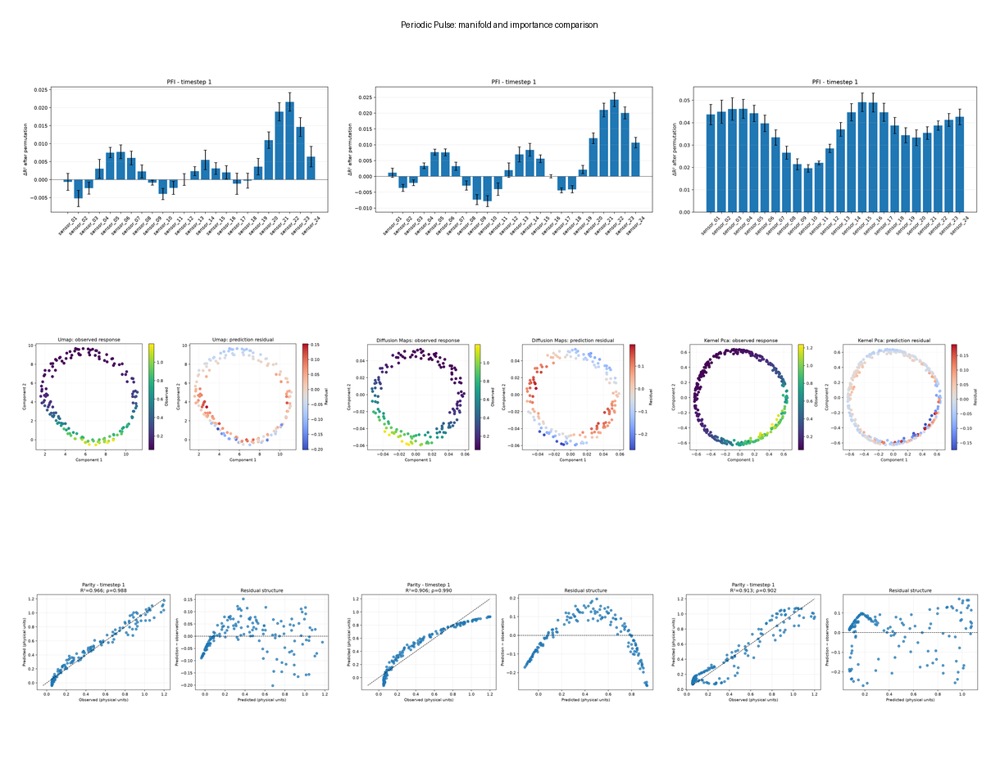
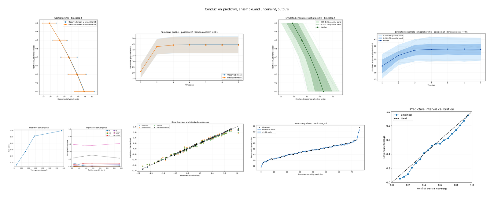
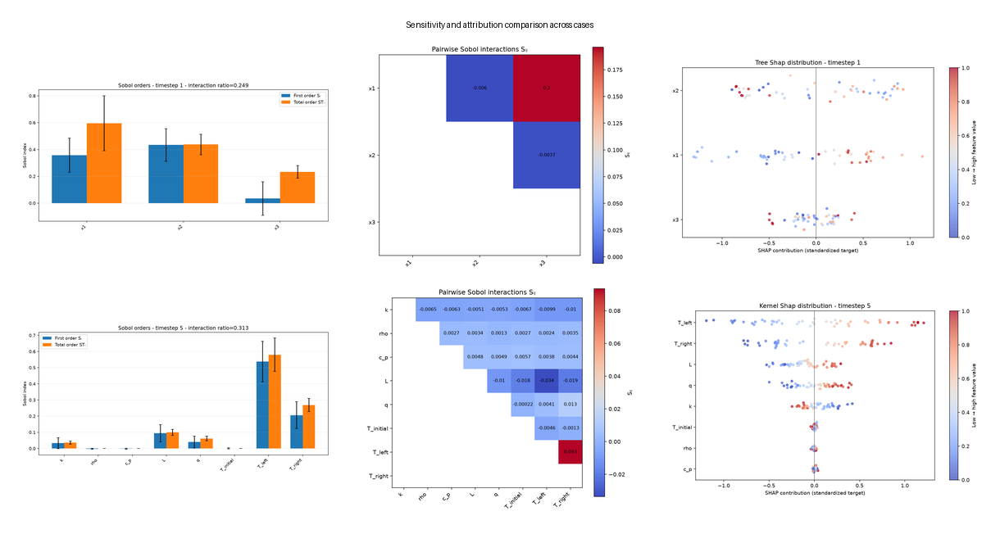
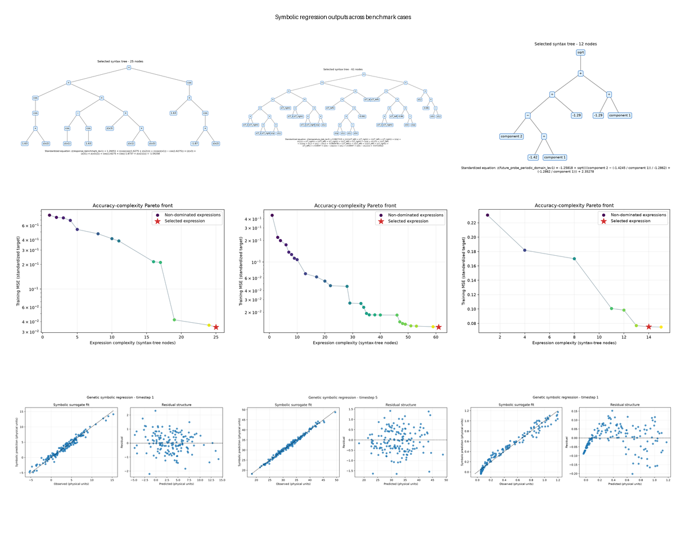
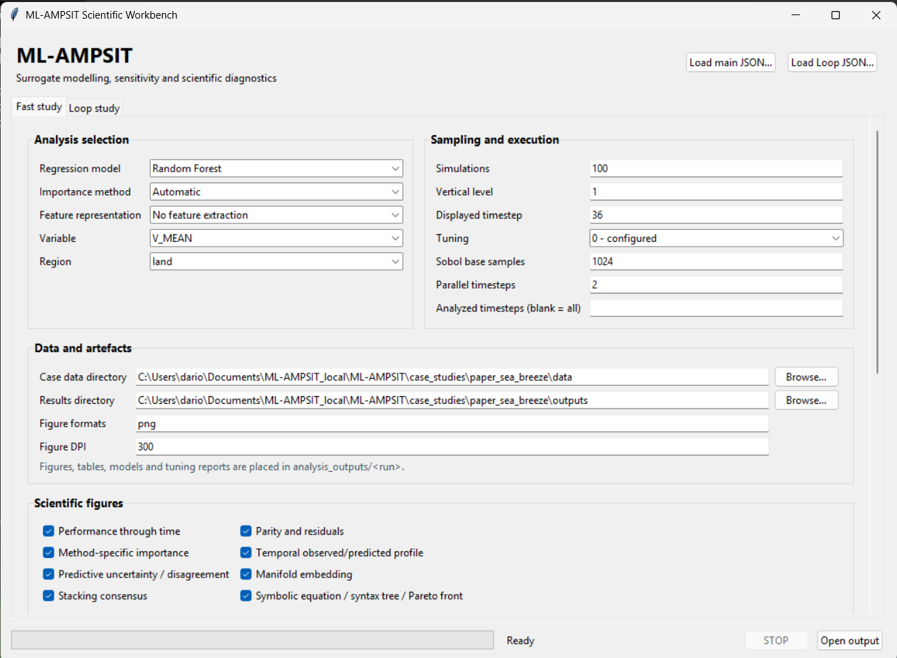
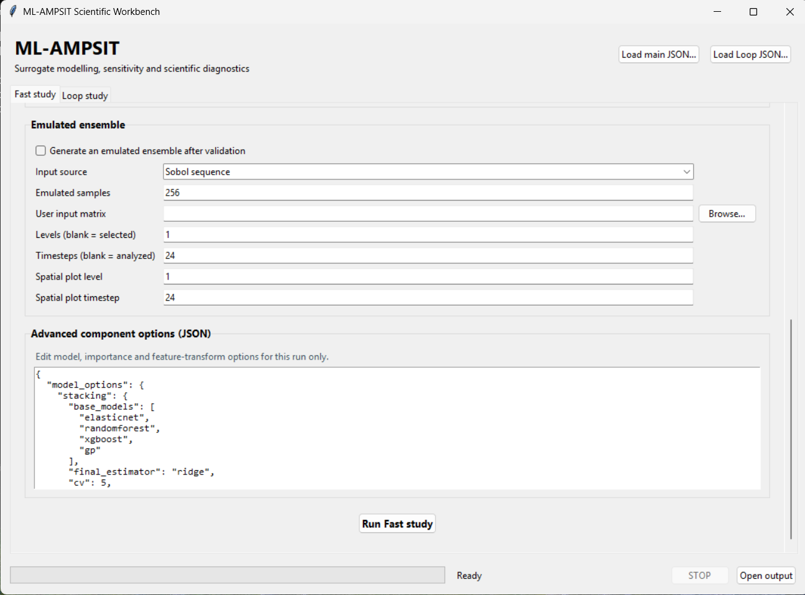
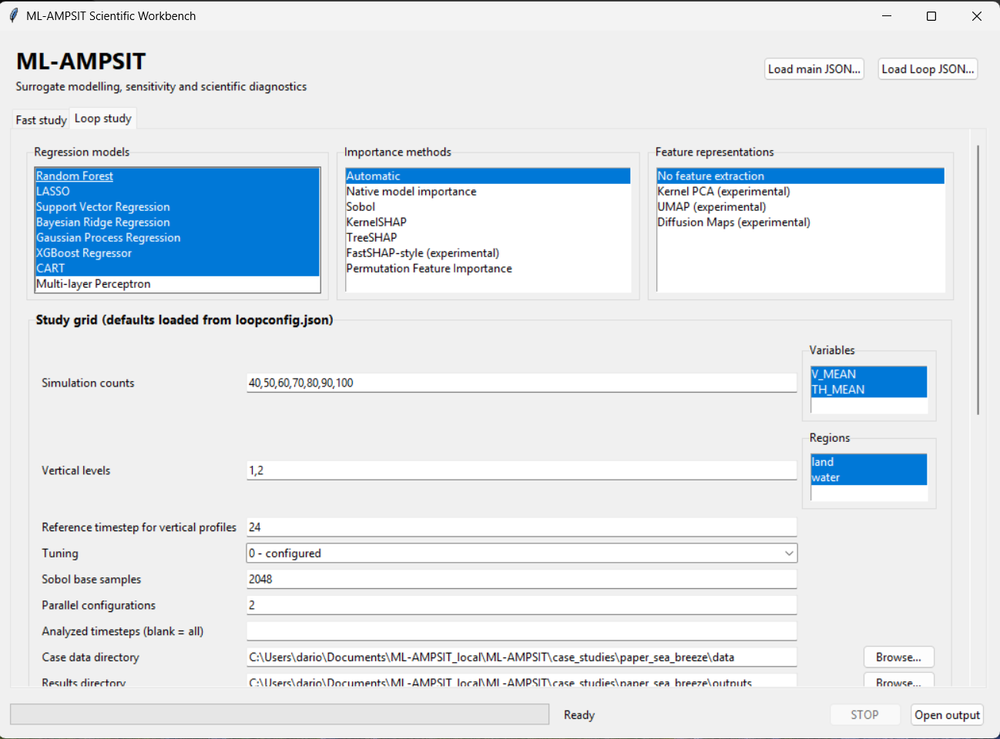
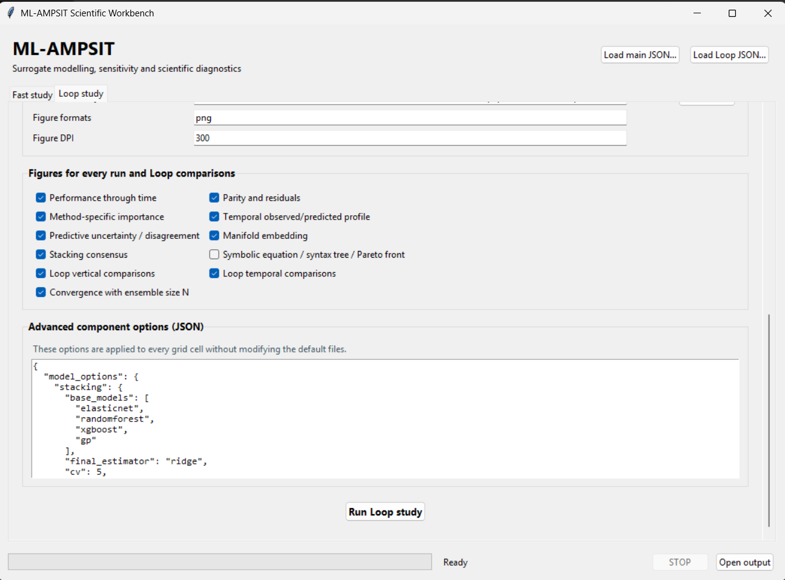

# ML-AMPSIT

[](https://zenodo.org/doi/10.5281/zenodo.10789929)

**Machine Learning-based Automated Multi-method Parameter Sensitivity and Importance analysis Tool**

ML-AMPSIT (Di Santo et al., 2025 [1]) is a machine-learning-based sensitivity and feature-importance framework for data typically obtained from a relatively small ensemble of high-fidelity, computationally expensive simulations. From paired input parameters and model responses, it learns a regression surrogate (also called an emulator) of the original input-output map. Once predictive skill has been established on held-out simulations, the same inexpensive approximation can be evaluated in place of the high-fidelity model.

Within this framework, a *feature* is an input parameter varied across the ensemble and the *target* is a selected output variable at a given region, level, and time. Depending on the model and analysis method, relevance may be expressed by signed coefficients, tree importance, variance-based sensitivity indices, permutation-induced skill loss, or sample-level Shapley attributions.

The original seven-model suite has been retained and expanded substantially. It now includes Random Forest (Breiman, 2001 [2]), Least Absolute Shrinkage and Selection Operator or LASSO (Tibshirani, 1996 [3]), Support Vector Regression (Smola and Schölkopf, 2004 [4]), Bayesian Ridge Regression (MacKay, 1992 [5]), Gaussian Process Regression (Rasmussen and Williams, 2006 [6]), XGBoost (Chen and Guestrin, 2016 [7]), and Classification and Regression Trees or CART (Breiman et al., 1984 [8]); it additionally provides a Multi-layer Perceptron (Rumelhart et al., 1986 [9]), Elastic Net (Zou and Hastie, 2005 [10]), a subset-of-data sparse Gaussian-process approximation (Quiñonero-Candela and Rasmussen, 2005 [11]), Kolmogorov-Arnold Networks (Liu et al., 2024 [12]), LightGBM (Ke et al., 2017 [13]), CatBoost (Prokhorenkova et al., 2018 [14]), Explainable Boosting Machines (Lou et al., 2012 [15]), NGBoost (Duan et al., 2020 [16]), consensus stacking in the stacked-generalization and Super Learner family (Wolpert, 1992 [17]; van der Laan et al., 2007 [18]), and genetic symbolic regression (Koza, 2010 [19]; Schmidt and Lipson, 2009 [20]). This range covers sparse linear relations, nonlinear kernels, individual and ensemble trees, neural function approximators, additive models, probabilistic regressors, and explicit symbolic expressions.

The surrogate is especially valuable when the desired diagnostic would be operationally infeasible on the original simulator. Approaches such as Sobol' global sensitivity analysis (Sobol', 2001 [21]) can require tens of thousands of model evaluations; Other integrated method for feature importance estimation now include: KernelSHAP (Lundberg and Lee, 2017 [22]) and TreeSHAP (Lundberg et al., 2020 [23]) which estimate Shapley-based feature contributions; the experimental FastSHAP-style path is motivated by amortized Shapley estimation (Jethani et al., 2021 [24]); and permutation feature importance follows the model-reliance idea used in Random Forests (Breiman, 2001 [2]). Evaluating these methods on a validated surrogate can reduce their operational cost by orders of magnitude.

The multi-method design is scientifically useful because different regressors encode different hypotheses about the unknown response surface. LASSO and Elastic Net privilege approximately linear, regularized structure; tree ensembles partition the input space and naturally represent nonlinearities and interactions; kernel and neural models construct flexible smooth or piecewise-smooth mappings; probabilistic regressors additionally estimate a predictive scale. When the true relation is not known a priori, agreement among independently structured, well-performing surrogates strengthens an interpretation, while disagreement identifies model-form uncertainty worth of being further investigated.

ML-AMPSIT v2.0.0 also implements a cross-validated stacking ensemble. Each base regressor is first used to generate out-of-fold predictions for the training ensemble; a meta-regressor learns how to combine those predictions without being trained on in-sample base predictions; the base learners are then refitted for final inference. This allows complementary inductive biases to contribute to one consensus prediction instead of merely comparing models side by side. ML-AMPSIT exports every member prediction, the consensus, and their dispersion.

The v2.0.0 framework further supports nonlinear dimensionality reduction through Kernel Principal Component Analysis (Schölkopf et al., 1998 [25]), UMAP (McInnes et al., 2018 [26]), and Diffusion Maps (Coifman and Lafon, 2006 [27]). Formally, these transforms map a standardized parameter vector from an ambient space $\mathbb{R}^{D}$ to lower-dimensional coordinates in $\mathbb{R}^{d}$. Kernel PCA obtains axes from eigenvectors of a centered kernel Gram matrix, thereby performing linear spectral decomposition in an implicit nonlinear feature space. Diffusion Maps constructs a normalized similarity operator and uses its leading non-trivial eigenvectors and eigenvalues as coordinates that preserve diffusion geometry at a selected scale. UMAP builds a weighted neighborhood graph representing a fuzzy topological structure and optimizes a low-dimensional graph with similar local connectivity. Each of these methods provide unsupervised directions determined from input geometry. ML-AMPSIT subsequently relates them to the output by fitting the surrogate in the transformed space and by coloring manifold coordinates with observed responses and residuals. Model-agnostic importance is still evaluated through the complete pipeline, so reported importance remains attached to the original physical parameters.

Finally, genetic symbolic regression searches for compact mathematical relationships between features and output. Candidate equations are represented as syntax trees whose leaves are standardized inputs or constants and whose internal nodes are protected mathematical operators. Evolutionary selection, subtree crossover, mutation, linear output scaling, and a parsimony penalty search jointly over functional form and coefficients. The result is an explicit candidate equation linking features to the output, accompanied by its syntax tree and the observed Pareto frontier between training error and expression complexity. Because the exported equation operates in standardized coordinates, it should not be interpreted as an automatically discovered physical law in dimensional units, but as a transparent approach of explainable-AI (XAI) to increase ML-based models interpretability.

**ML-AMPSIT is model agnostic**: any numerical simulator can be analyzed when its ensemble is represented by the documented parameter matrix and scalar target files.  WRF and Noah-MP are not requirements.

The current release is **2.0.0** and requires **Python 3.10 or newer**. The main interfaces are a native Tk desktop application and a headless command-line interface.

For the methodology and original case study, cite:

> Di Santo et al. (2025 [1]), [“ML-AMPSIT: Machine Learning-based Automated Multi-method Parameter Sensitivity and Importance analysis Tool”](https://doi.org/10.5194/gmd-18-433-2025), *Geoscientific Model Development*, 18, 433-459.

## Contents

- [What ML-AMPSIT can do](#what-ml-ampsit-can-do)
- [Execution modes](#execution-modes)
- [Installation](#installation)
- [Five-minute start with the included case](#five-minute-start-with-the-included-case)
- [Included case studies](#included-case-studies)
- [Input data contract](#input-data-contract)
- [Configuration reference](#configuration-reference)
- [Desktop GUI guide](#desktop-gui-guide)
- [Command-line guide](#command-line-guide)
- [End-to-end generic workflow](#end-to-end-generic-workflow)
- [Optional WRF/Noah-MP workflow](#optional-wrfnoah-mp-workflow)
- [Scientific glossary](#scientific-glossary)
- [Figures and output artefacts](#figures-and-output-artefacts)
- [Tests and supplied trial studies](#tests-and-supplied-trial-studies)
- [Extending ML-AMPSIT](#extending-ml-ampsit)
- [Troubleshooting and limitations](#troubleshooting-and-limitations)
- [References](#references)

## What ML-AMPSIT can do

ML-AMPSIT provides one reproducible pipeline for:

- generating a scrambled Sobol' low-discrepancy design (Sobol', 1967 [28]) for a high-fidelity simulation ensemble (optional);
- extracting time-, level-, and region-dependent targets from WRF-like NetCDF files (optional);
- fitting one of 17 regression surrogates, from linear models and tree ensembles to Gaussian processes, neural models, stacking, and symbolic regression;
- optionally transforming the feature space with Kernel PCA, UMAP, or Diffusion Maps;
- optimizing supported model hyperparameters with Bayesian optimization (Snoek et al., 2012 [29]) and cross-validation or reloading a previously tuned model;
- measuring hold-out performance with R², Spearman's rank correlation (Spearman, 1904 [30]) and its p-value, MSE, and MAE;
- estimating parameter importance with native importance, Sobol indices, KernelSHAP, TreeSHAP, a FastSHAP-style approximation, or permutation feature importance;
- producing method-aware plots, physical-unit prediction tables, fitted models, tuning reports, and reproducibility manifests;
- refitting validated surrogates on the complete available ensemble and using them to emulate a new Sobol design or a user-provided parameter matrix;
- exporting reusable physical-unit surrogate bundles, emulated predictions, distribution summaries, and spatial and temporal ensemble profiles;
- running a single Fast study or a Cartesian Loop study over models, sample sizes, variables, regions, levels, importance methods, and feature representations;
- comparing vertical profiles, temporal profiles, and convergence with ensemble size across Loop runs;
- executing the same workflows from the desktop GUI and CLI.


## Schematic architecture of v2.0.0

[](docs/readme_panels/ml-ampsit.png)


## Execution modes

| Mode | Purpose | Primary entry point | Parallelism |
|---|---|---|---|
| **Fast** | One combination of model, variable, region, level, sample count, importance method, and feature representation; it may still analyze many timesteps. | `ml-ampsit-fast` or `ml-ampsit-cli run --mode fast` | Timesteps run in a thread pool controlled by `parallel_workers`. |
| **Loop** | Cartesian product of multiple models, sample counts, variables, regions, levels, importance methods, and feature representations. | `ml-ampsit-loop` or `ml-ampsit-cli run --mode loop` | Independent grid cells run in worker processes. Each cell analyzes its timesteps serially. |
| **Sample** | Generate the high-fidelity ensemble design `X.txt`. | `ml-ampsit-sample` | One preprocessing operation. |
| **WRF extraction** | Convert a set of WRF-like NetCDF outputs into ML-AMPSIT target files. | `ml-ampsit-wrfload` | One preprocessing operation. |

Emulated ensemble generation is an optional final stage of a Fast study. Hold-out evaluation remains separate: ML-AMPSIT first measures the surrogate on unseen high-fidelity rows, then clones the validated estimator and refits one deployment bundle on all available rows for each requested level and timestep. The deployment bundles are used only after validation and accept parameters in their original physical units.

“Fast” mode runs a single study configuration (see later for details on configurations). A Fast study using Gaussian processes, SHAP, many timesteps, or hyperparameter tuning can still be computationally demanding.

## Installation

### Windows PowerShell

From the directory containing `pyproject.toml`:

```powershell
py -3.10 -m venv .venv
.\.venv\Scripts\python.exe -m pip install --upgrade pip
.\.venv\Scripts\python.exe -m pip install -e .
```

The editable installation creates these launchers in `.venv\Scripts`:

```text
ml-ampsit.exe          combined Fast/Loop desktop application
ml-ampsit-fast.exe     desktop application opened on Fast
ml-ampsit-loop.exe     desktop application opened on Loop
ml-ampsit-cli.exe      headless analysis CLI
ml-ampsit-sample.exe   parameter-design generator
ml-ampsit-wrfload.exe  WRF target extractor
```

Use the full path if the virtual environment is not activated.

### Linux and macOS

```bash
python3 -m venv .venv
source .venv/bin/activate
python -m pip install --upgrade pip
python -m pip install -e .
```

Tkinter is included by many Python distributions. On Linux it may be a separate system package, commonly named `python3-tk`. A graphical display and Tk are not required for `ml-ampsit-cli`.

### Optional scientific components

The core installation includes the standard regressors, MLP, Elastic Net, the subset sparse-GP approximation, stacking, genetic symbolic regression, all importance methods, Kernel PCA, and Diffusion Maps.

Install LightGBM, CatBoost, EBM, NGBoost, and UMAP with:

```powershell
.\.venv\Scripts\python.exe -m pip install -r requirements-optional.txt
```

Install KAN separately because PyTorch is substantially larger:

```powershell
.\.venv\Scripts\python.exe -m pip install -r requirements-kan.txt
```

For tests:

```powershell
.\.venv\Scripts\python.exe -m pip install -r requirements-dev.txt
```

## Quick-start with one of the included cases

The notorious analytical Ishigami[31] model is integrated as a case study committed ready to run. Every case is self-contained under `case_studies/<case>`: `config.json` describes the study, `data/` contains `X.txt` and targets, `truth.json` records the known functional structure, and generated products go to the ignored `outputs/` directory.

1. Install the package as described above.
2. Validate a small study without fitting (dry-run):

   ```powershell
   .\.venv\Scripts\ml-ampsit-cli.exe run --config case_studies\ishigami\config.json --dry-run
   ```

3. Run the study:

   ```powershell
   .\.venv\Scripts\ml-ampsit-cli.exe run --config case_studies\ishigami\config.json
   ```

4. Inspect the JSON summary printed to the terminal and open:

   ```text
   case_studies/ishigami/outputs/analysis_outputs/
   ```

5. To perform the same kind of study interactively, launch:

   ```powershell
   .\.venv\Scripts\ml-ampsit.exe
   ```

   Load `case_studies\ishigami\config.json`, review the pre-populated Fast controls, and select **Run Fast study**. More on the GUI below.

Relative paths in a JSON file are resolved against the directory containing the JSON that declares them. You can therefore launch these commands from another working directory without changing `data_pathname` or `output_pathname`.

## Included case studies

Together with Ishigami model case study, the codebase includes some other benchmarks:

```text
case_studies/
  generate_cases.py
  ishigami/{config.json, config_tuning.json, config_loop.json, config_loop_tuning.json, truth.json, data/, outputs/}
  traveling_gaussian_pulse/{config.json, config_tuning.json, config_loop.json, config_loop_tuning.json, truth.json, data/, outputs/}
  transient_heat_1d/{config.json, config_tuning.json, config_loop.json, config_loop_tuning.json, truth.json, data/, outputs/}
  paper_sea_breeze/{config.json, config_tuning.json, config_loop.json, config_loop_tuning.json, data.zip, data/, outputs/}
```

| Case | Known map and purpose | Expected importance structure |
|---|---|---|
| `ishigami` | $y=\sin x_1+7\sin^2x_2+0.1x_3^4\sin x_1$ on independent $[-\pi,\pi]$ inputs; standard nonlinear sensitivity benchmark [31]. | First order: $x_2>x_1>x_3=0$. Total order: $x_1>x_2>x_3$ because $x_3$ acts only through the $x_1x_3$ interaction. Exact indices are in `truth.json`. |
| `traveling_gaussian_pulse` | A periodic Gaussian pulse is sampled by 24 spatial sensors. Its phase and amplitude are the only latent degrees of freedom, producing a two-dimensional cylindrical manifold in the 24-dimensional observation space. The target is the fixed-probe response after a known translation [32]. | Manifold methods should recover a compact representation that retains phase and amplitude. `latent_coordinates.csv` provides the exact latent values for independent inspection. |
| `transient_heat_1d` | Exact sine-series solution of $\rho c_p \partial T/\partial t=k\partial^2T/\partial x^2+q$ in a slab. Five interior sensors are sampled at seven times from 0 to 672 hours. | Initially $T_{initial}$ dominates. $T_{left}$ and $T_{right}$ dominate near their respective boundaries. The transient depends on $\alpha=k/(\rho c_p)$ and $Fo=\alpha t/L^2$. At long times, boundary temperatures and $qL^2/k$ determine the spatial profile [33]. |


Ishigami and transient heat use deterministic scrambled-Sobol designs with 512 rows and seed 42. The traveling-pulse case uses 1024 scrambled-Sobol samples in its two-dimensional latent space and maps them to 24 sensor observations.
The heat-conduction case uses `vertical_level` as the sensor index along the slab, from left to right. Its configuration maps levels 1 through 5 to the dimensionless coordinates $x/L=0.1,0.3,0.5,0.7,0.9$. For data generation, timestep indices map to the physical times 0, 6, 24, 72, 168, 336, and 672 hours. Temporal plot axes remain unit-agnostic and are labelled `Timestep`.

Regenerate all three cases at any time:

```powershell
.\.venv\Scripts\python.exe case_studies\generate_cases.py all
```

To run another analytical case, only point the CLI or GUI to its local `config.json`:

```powershell
.\.venv\Scripts\ml-ampsit-cli.exe run --config case_studies\traveling_gaussian_pulse\config.json --dry-run
.\.venv\Scripts\ml-ampsit-cli.exe run --config case_studies\traveling_gaussian_pulse\config.json
```

### Tuned case-study configurations

Every case also supplies a `config_tuning.json`. It inherits the corresponding `config.json`, enables Bayesian optimization with `tuning: 1`, declares a case-appropriate search space, and writes results below `outputs/tuning/` so that standard results are not overwritten.

Validate and launch one tuned case with:

```powershell
.\.venv\Scripts\ml-ampsit-cli.exe run --config case_studies\ishigami\config_tuning.json --dry-run
.\.venv\Scripts\ml-ampsit-cli.exe run --config case_studies\ishigami\config_tuning.json
```

The transient heat and sea-breeze cases tune a separate surrogate at each selected timestep, so they are more expensive than the single-timestep cases.

The published sea-breeze case requires its `data.zip` archive to be extracted as described below.

### Loop case-study configurations

Every case also includes a configured Loop comparison and its tuned counterpart. Emulated ensembles remain disabled in all Loop configurations.

| Case | `config_loop.json` coverage | `config_loop_tuning.json` |
|---|---|---|
| `ishigami` | Random Forest, Gaussian Process, stacking, and symbolic regression with PFI and every applicable plot family. Run `verify_all_importance.json` alongside it for native importance, Sobol, KernelSHAP, TreeSHAP, FastSHAP-style importance, and PFI on XGBoost. | Same model comparison with 16 Bayesian trials per tunable model. Stacking uses its configured members without an external search space. `verify_all_importance_tuning.json` provides the tuned counterpart of the complete importance sweep. |
| `traveling_gaussian_pulse` | XGBoost and symbolic regression with raw sensor profiles, Kernel PCA, UMAP, and Diffusion Maps. The 24 observations lie on a known two-dimensional cylindrical manifold, and every nonlinear representation produces a manifold map. | Same eight model-representation cells with 16 Bayesian trials per cell. |
| `transient_heat_1d` | XGBoost, Random Forest, stacking, and symbolic regression across all five positions and seven timesteps. Produces applicable model plots plus spatial and temporal Loop comparisons. | Same 20 model-position cells with 10 Bayesian trials for every tunable model and timestep. |
| `paper_sea_breeze` | Random Forest, XGBoost, stacking, and symbolic regression for both variables, both regions, two levels, and seven representative timesteps. Produces applicable model, spatial, and temporal products. | Same grid with 10 Bayesian trials for every tunable model and timestep. |

The Ishigami workflow is deliberately split into two compatible Loop grids. `config_loop.json` compares structurally different surrogates using PFI. `verify_all_importance.json` applies every importance estimator to XGBoost, for which native importance and TreeSHAP are valid. Its tuned counterpart is `verify_all_importance_tuning.json`, which performs 16 Bayesian trials for each importance-method cell. Combining both dimensions into one Cartesian grid would attempt invalid pairs such as TreeSHAP with Gaussian Process or symbolic regression.


As said before, the tuned thermal and sea-breeze grids are more expensive. Inspect the corresponding untuned Loop first and reduce the grid or `tun_iter` during development if needed.

A useful workflow is to use Loop mode to compare model families, transformations, importance stability, and held-out skill. The best validated model and representation can then be copied into a focused Fast configuration. If an emulated ensemble is required, enabling it only in that Fast configuration produces predictions from the most accurate validated surrogate without repeating inference for every Loop cell.

### Other test configurations

Some other test configurations are included to explore the tool capabilities:

| Configuration | Coverage |
|---|---|
| `ishigami/verify_all_importance.json` | XGBoost with native importance, Sobol, KernelSHAP, TreeSHAP, FastSHAP-style importance, and PFI. This produces Sobol-order, Sobol-interaction, SHAP-distribution, and permutation plots. |
| `ishigami/verify_all_importance_tuning.json` | Tuned counterpart of the complete XGBoost importance sweep, with 16 Bayesian trials for each importance-method cell and results in `outputs/importance_tuning/`. |
| `ishigami/verify_models.json` | Random Forest, Gaussian Process, stacking, and symbolic regression. This adds probabilistic uncertainty, ensemble-member, symbolic-equation, syntax-tree, fit, and Pareto plots. |
| `traveling_gaussian_pulse/verify_reductions.json` | XGBoost and symbolic regression with no transform, Kernel PCA, UMAP, and Diffusion Maps. Every nonlinear reduction produces manifold plots for data with known intrinsic dimension two. |
| `transient_heat_1d/verify_models.json` | XGBoost, Random Forest, and stacking at all five positions and seven times, including spatial, temporal, uncertainty, and ensemble products. |
| `transient_heat_1d/verify_symbolic.json` | Symbolic regression at all positions and representative times, including equation, tree, fit, Pareto, spatial, and temporal products. |
| `transient_heat_1d/verify_convergence.json` | XGBoost at four ensemble sizes, producing predictive and importance convergence plots. |


### Plot examples

The panels below illustrate some of the products generated by the case-study workflows.

**Nonlinear dimensionality reduction for the traveling Gaussian pulse.** UMAP, Diffusion Maps, and Kernel PCA provide compact representations of the periodic sensor profiles. Response-colored embeddings, residual structure, parity plots, and PFI compare how much predictive information each representation retains. All three embeddings reveal the periodic low-dimensional structure of the pulse, while response coloring follows its phase and the most informative sensors cluster near the prediction location.

[](docs/readme_panels/02_periodic_pulse_manifold_comparison.png)

**Predictive and emulation outputs for transient heat conduction.** Spatial and temporal validation profiles compare observed and surrogate responses. Emulated-ensemble bands, convergence, stacked-model consensus, predictive uncertainty, and interval calibration provide complementary checks on surrogate reliability. the surrogate reproduces the spatial temperature gradient and its temporal approach to equilibrium. The emulated ensemble preserves both structures.

[](docs/readme_panels/03_conduction_predictive_overview.png)

**Global sensitivity and local attribution across cases.** Sobol indices summarize main effects and pairwise interactions for independent physical inputs, while SHAP distributions describe surrogate contributions across individual samples. Ishigami shows the known main effects and the interaction-mediated role of \(x3\), while transient heat is dominated by the left boundary temperature (plots are referred to its first-level/left-boundary).

[](docs/readme_panels/04_sensitivity_and_attribution_comparison.png)

**Symbolic regression across the benchmark cases.** The selected syntax trees provide compact surrogate expressions in standardized coordinates. Their Pareto fronts show the trade-off between predictive error and expression complexity.

[](docs/readme_panels/01_symbolic_regression_overview.png)


## Input data contract

For analysis, input data and generated artefacts have separate roots. `data_pathname` must initially contain:

```text
data_pathname/
  X.txt
  <VARIABLE>_<REGION>_lev<LEVEL>_<TIMESTEP>.txt
  ...
```

For example:

```text
case_studies/ishigami/data/
  X.txt
  response_benchmark_lev1_1.txt
```

Generated figures, tables, reports, and models are written below `<output_pathname>/analysis_outputs/`.

### `X.txt`: parameter design

`X.txt` is a whitespace-delimited `N × D` numeric matrix:

- `N` rows are simulation realizations;
- `D` columns are parameters;
- column order must exactly match `parameter_names` in the main JSON;
- row `i` must describe the same realization as target value `i` in every target file.

Example with 8 simulations and 4 parameters:

```text
0.03970 18.78297 0.83512 0.51916
0.04016 15.37639 0.72693 0.44887
0.04039 16.65808 0.95579 0.45687
0.03987 13.25131 0.68650 0.37546
0.03994 17.40794 0.77859 0.39695
0.04022 14.00146 0.86913 0.47863
0.04004 17.93301 0.65800 0.42686
0.03978 16.19677 0.66596 0.48523
```

The selected sample count uses the first `N_selected` rows. At least 8 paired samples are required.

### Target files

Each target file contains one scalar output for every realization. The current filename contract is:

```text
<VARIABLE>_<REGION>_lev<LEVEL>_<TIMESTEP>.txt
```

For variable `V`, region `valley`, level 1, timestep 3:

```text
V_valley_lev1_3.txt
```

The file is read with a comma delimiter and then flattened. A single comma-separated row is the clearest representation:

```text
1.3085256815,1.3201601505,1.2770142555,1.1629282236,1.3877079487,0.8722674251,1.3292431831,1.4768025875
```

Important rules:

- indices in filenames and configurations are **1-based**;
- target order must match the rows of `X.txt`;
- a target may contain more values than the selected sample count; only the required leading values are used;
- if either input or target is shorter, their common leading length is used, and it must be at least 8;
- all requested combinations of variable, region, level, and timestep must exist;
- a 2-D surface variable has only `lev1` when produced by the WRF extractor;
- values should be finite numeric scalars; invalid values will generally be rejected by the selected estimator;

If there are `V` variables, `R` regions, `L` levels, and `T` timesteps, a fully three-dimensional dataset has `V × R × L × T` target files. Surface variables reduce their level count to one.

### Parameter ranges

The default physical range for parameter `j` is declared by:

```json
{
  "MATRIX": [
    [0.040, 30.0],
    [16.0, 30.0]
  ]
}
```

Each row is `[reference_value, perturbation_percent]`, giving `reference ± |reference| × percentage / 100`. These a-priori bounds are used both by the optional sample generator and by surrogate-based Sobol analysis. They do not depend on the observed minimum and maximum or on a train/test split.

For asymmetric limits, or for a parameter whose reference value is zero, provide explicit bounds:

```json
{
  "parameter_bounds": [
    [0.025, 0.055],
    [10.0, 22.0]
  ]
}
```

`parameter_bounds` takes precedence over `MATRIX` and must have one `[lower, upper]` row per `parameter_names` entry.

## Configuration reference

### Main JSON

`configAMPSIT.json` supplies dataset metadata, defaults, component options, plotting options, and optional WRF metadata.

| Key | Meaning |
|---|---|
| `totalsim` | Total available or generated realizations. GUI sample counts must be between 8 and this value. |
| `parameter_names` | Ordered names of the `X.txt` columns. |
| `MATRIX` | One `[reference, perturbation_percent]` row per parameter. |
| `parameter_bounds` | Optional explicit physical bounds; overrides `MATRIX`. |
| `data_pathname` | Required directory containing `X.txt` and target files. |
| `output_pathname` | Results root; generated artefacts are placed below `analysis_outputs/`. |
| `variables` | Ordered target-variable labels used in filenames and 1-based selections. |
| `regions` | Ordered region labels used in filenames and 1-based selections. |
| `verticalmax` | Maximum selectable vertical level. |
| `totaltimesteps` | Maximum available timestep index. |
| `spatial_coordinates` | Optional physical or dimensionless coordinate for each level, used by spatial plots. |
| `spatial_coordinate_name`, `spatial_coordinate_units` | Optional spatial-axis label and units. |
| `time_values` | Optional physical time corresponding to each 1-based timestep. |
| `time_coordinate_name`, `time_coordinate_units` | Optional time-axis label and units. |
| `tun_iter` | Number of `BayesSearchCV` trials when tuning mode is 1. |
| `random_seed` | Reproducible split, sampling, model, SHAP, and tuning seed where supported. |
| `importance_method` | Default importance key. |
| `feature_transform` | Default feature representation key. |
| `sobol_samples` | Default base sample size for surrogate Sobol analysis. |
| `parallel_workers` | Default Fast timestep concurrency. |
| `tuning_workers` | Parallel jobs inside Bayesian hyperparameter search. |
| `model_options` | Per-model constructor overrides. |
| `tuning_spaces` | Optional per-model replacement spaces for Bayesian tuning. Omitted models use their registered spaces. |
| `importance_options` | Per-importance-method overrides. |
| `transform_options` | Per-transform constructor overrides. |
| `emulated_ensemble` | Optional Fast-stage configuration for full-data surrogate bundles and new ensemble predictions. |
| `plot_options` | Enabled plot families, formats, DPI, and figure-close behavior. |

### Emulated ensemble configuration

The default source is a new scrambled Sobol sequence within `parameter_bounds`, or within the bounds derived from `MATRIX`. A different scramble seed is used from the high-fidelity design unless `seed` is set explicitly.

```json
{
  "emulated_ensemble": {
    "enabled": true,
    "source": "sobol",
    "sample_count": 256,
    "seed": 100045,
    "input_path": "",
    "levels": [1, 2, 3, 4, 5],
    "timesteps": [1, 2, 3, 4, 5, 6, 7],
    "plot_level": 3,
    "plot_timestep": 5,
    "member_lines": 20,
    "allow_extrapolation": false
  }
}
```

| Key | Meaning |
|---|---|
| `enabled` | Run emulation after a successful Fast validation and normal plot generation. |
| `source` | `sobol` generates a new scrambled sequence; `matrix` reads `input_path`. |
| `sample_count` | Number of new Sobol rows. Ignored for a user matrix. Minimum 2. |
| `seed` | Scrambling seed for the new Sobol sequence. If omitted, `random_seed + 100003` is used. |
| `input_path` | Whitespace-delimited `.txt` or comma-delimited `.csv` matrix without a header. Relative paths are resolved from the JSON file that declares them. |
| `levels` | Target levels for which full-data bundles and predictions are produced. |
| `timesteps` | Target timesteps. Every requested timestep must also occur in `fast_study.timesteps`. |
| `plot_level` | Level summarized in the temporal emulated-ensemble plot. |
| `plot_timestep` | Timestep summarized in the spatial emulated-ensemble plot. |
| `member_lines` | Maximum number of individual emulated realizations drawn behind percentile bands. Use 0 to hide them. |
| `allow_extrapolation` | If `false`, reject matrix rows outside the configured parameter bounds. If `true`, retain them and record their count in the manifest. |

For matrix-driven inference, change only the source and path:

```json
{
  "emulated_ensemble": {
    "enabled": true,
    "source": "matrix",
    "input_path": "new_parameter_matrix.csv"
  }
}
```

The matrix must contain one finite numeric column per `parameter_names` entry in exactly the same order. It may contain a single row to query one complete input configuration. In that case, ML-AMPSIT produces its temporal and spatial emulated profiles as single curves without ensemble quantile bands.

The following keys are used by optional preprocessing:

| Key | Consumer | Meaning |
|---|---|---|
| `folder`, `vegtype` | `autofill.sh` | Reference simulation directory and Noah-MP vegetation column. |
| `input_pathname` | WRF extractor | Directory containing numbered NetCDF outputs. |
| `ncfile_format` | WRF extractor | Filename prefix; matching files must end in `_<integer>`. |
| `is_3d` | WRF extractor | One truthy/falsy entry per variable; 3-D arrays are read as `[time, level, y, x]`, 2-D arrays as `[time, y, x]`. |
| `x1`, `y1`, `x2`, `y2`, ... | WRF extractor | Zero-based horizontal center coordinates corresponding to the ordered `regions`. |
| `wrf_extraction.spatial_average` | WRF extractor | Optional boolean, default `false`. If `false`, extract only the value at each configured `(y, x)` point. If `true`, calculate a spatial `nanmean`. |
| `wrf_extraction.x_points` | WRF extractor | Number of grid points along x in the averaging window; default `1`. |
| `wrf_extraction.y_points` | WRF extractor | Number of grid points along y in the averaging window; default `1`. |
### Self-contained or inherited study JSON

A study can inherit a main configuration and override only what changes:

```json
{
  "base_config": "../configAMPSIT.json",
  "run_mode": "fast",
  "totaltimesteps": 3,
  "fast_study": {
    "model": "br",
    "sample_count": 20,
    "variable_index": 1,
    "region_index": 1,
    "vertical_level": 1,
    "timesteps": [2, 3],
    "selected_timestep": 2,
    "tuning": 0,
    "importance_method": "sobol",
    "feature_transform": "none",
    "sobol_samples": 32,
    "parallel_workers": 2,
    "plot_kinds": ["performance", "prediction", "importance", "temporal", "uncertainty"]
  }
}
```

Nested objects are deep-merged with the base configuration. A relative `base_config` is resolved from the study file; relative `input_pathname`, `data_pathname`, and `output_pathname` are resolved from the file that declares each path.

### Fast study keys

| Key | Default | Meaning |
|---|---|---|
| `model` | required | Stable model key. |
| `sample_count` | `totalsim` | Leading realizations to use. |
| `variable_index` | `1` | 1-based entry in `variables`. |
| `region_index` | `1` | 1-based entry in `regions`. |
| `vertical_level` | `1` | 1-based level. |
| `timesteps` | all `1..totaltimesteps` | Timesteps to analyze; may be non-contiguous. |
| `selected_timestep` | required | Timestep used by single-timestep figures; it must be in `timesteps`. |
| `tuning` | `0` | `0`: configured fit; `1`: optimize and save; `2`: load saved tuned estimator. |
| `importance_method` | main default | Importance estimator key. |
| `feature_transform` | main default | Feature representation key. |
| `sobol_samples` | main default | Base Sobol size. |
| `parallel_workers` | main default | Number of timesteps analyzed concurrently. |
| `plot_kinds` | `plot_options.enabled` | Requested per-run plot families. |

### Loop study keys

A Loop study is declared in the main or inherited study JSON as `loop_study`.

| Key | Meaning |
|---|---|
| `models` | Stable model keys. |
| `sample_counts` | Simulation counts. |
| `variable_indices` | 1-based variable indices. |
| `vertical_levels` | Vertical levels. |
| `region_indices` | 1-based region indices. |
| `importance_methods` | Importance keys included in the Cartesian product. |
| `feature_transforms` | Feature-representation keys included in the Cartesian product. |
| `tuning` | Tuning mode applied to every grid cell. |
| `timesteps` | Optional analyzed timesteps; omitted means all configured timesteps. |
| `selected_timestep` | Reference timestep for vertical and single-timestep plots. |
| `sobol_samples` | Base Sobol size used by every applicable grid cell. |
| `parallel_workers` | Concurrent process count. |
| `plot_kinds` | Per-run plot families. |
| `comparison_kinds` | Any of `spatial`, `temporal`, and `convergence`. |
| `retry_failed_serially` | Retry failed process-pool cells once in the parent process; defaults to `true`. |

The number of Loop cells is:

```text
len(models) × len(sample_counts) × len(variable_indices) × len(vertical_levels) × len(region_indices)
× len(importance_methods) × len(feature_transforms)
```

Timesteps are analyzed inside each cell and do not multiply the reported `combination_count`.

### Advanced component options

Constructor options are grouped by stable keys:

```json
{
  "model_options": {
    "randomforest": {"n_estimators": 300, "max_depth": 10, "n_jobs": 1},
    "stacking": {
      "base_models": ["elasticnet", "randomforest", "xgboost", "gp"],
      "final_estimator": "ridge",
      "cv": 5,
      "passthrough": false,
      "n_jobs": 1
    },
    "sparse_gp": {"n_inducing": 64},
    "symbolic": {
      "population_size": 300,
      "generations": 25,
      "max_depth": 5,
      "parsimony_coefficient": 0.001
    }
  },
  "tuning_spaces": {
    "randomforest": {
      "n_estimators": {"type": "integer", "low": 100, "high": 600},
      "max_depth": {"type": "integer", "low": 2, "high": 20},
      "max_features": {
        "type": "categorical",
        "values": ["sqrt", "log2", null]
      }
    },
    "elasticnet": {
      "alpha": {
        "type": "real",
        "low": 0.000001,
        "high": 10.0,
        "prior": "log-uniform"
      },
      "l1_ratio": {"type": "real", "low": 0.0, "high": 1.0}
    }
  },
  "importance_options": {
    "sobol": {"interaction_tolerance": 0.01, "batch_size": 16384},
    "pfi": {"n_repeats": 20, "scoring": "r2", "n_jobs": 1},
    "kernel_shap": {"background": 64, "evaluations": 128},
    "fast_shap": {"calibration": 64, "evaluations": 128}
  },
  "transform_options": {
    "kernel_pca": {"n_components": 3, "kernel": "rbf"},
    "umap": {"n_components": 3, "n_neighbors": 15},
    "diffusion_maps": {"n_components": 3, "diffusion_time": 1, "alpha": 0.5}
  }
}
```

Values in `model_options`, `importance_options`, and `transform_options` override constructor or method defaults. `tuning_spaces` controls the ranges explored in tuning mode 1. Each model entry replaces that model's complete registered search space; omit the model to retain its built-in space, or assign an empty object to fit configured parameters without an external Bayesian search.

A tuning dimension accepts one of these JSON forms:

| Type | Required fields | Optional fields | Meaning |
|---|---|---|---|
| `integer` | `type`, `low`, `high` | `prior`, `base` | Inclusive integer range. |
| `real` | `type`, `low`, `high` | `prior`, `base` | Continuous range; `prior` may be `uniform` or `log-uniform`. |
| `categorical` | `type`, non-empty `values` | `weights` | Finite set of alternatives. A bare JSON array is accepted as categorical shorthand. |

Parameter names are checked against the selected estimator before fitting. Unknown names, malformed ranges, empty categories, and inconsistent weights produce explicit configuration errors. Nested categorical arrays, such as neural-network layer sizes, are converted to tuples expected by scikit-learn.

## Desktop GUI guide

### Starting the application

```powershell
# Combined workbench; opens the mode selected by run_mode, defaulting to Fast
.\.venv\Scripts\ml-ampsit.exe

# Open a specific tab
.\.venv\Scripts\ml-ampsit-fast.exe
.\.venv\Scripts\ml-ampsit-loop.exe

# Load files at startup
.\.venv\Scripts\ml-ampsit.exe --config .\my_study.json
.\.venv\Scripts\ml-ampsit-loop.exe --config .\my_loop_study.json
```

Portable equivalent:

```bash
python -m ampsit --mode auto --config configAMPSIT.json
```

The desktop command accepts `--mode {auto,fast,loop}` and `--config PATH`.

### Header, tabs, and footer

- **Load main JSON…** replaces the current main/study JSON and rebuilds both tabs. It is disabled by warning while an analysis is active.
- **Fast study / Loop study** switches interfaces; both use the same loaded dataset metadata.
- The **progress bar** is set to completion for Fast and advances by finished grid cells for Loop.
- The **status text** reports readiness, progress, completion, cancellation, or a concise exception.
- **STOP** requests cooperative cancellation. It does not kill an estimator during a fit.
- **Open output** creates, then opens, the active tab's data/output directory on Windows. On other platforms the current implementation displays its path.

Closing the window during a run asks for confirmation, requests cancellation, and closes only after active fits finish safely.

### Fast tab: every control




| Section | Control | Effect |
|---|---|---|
| Analysis selection | **Regression model** | Selects one registered surrogate. Missing optional packages and experimental status are shown in the label. |
| | **Importance method** | Selects `auto`, native, Sobol, KernelSHAP, TreeSHAP, FastSHAP-style, or PFI. |
| | **Feature representation** | Selects raw standardized features, Kernel PCA, UMAP, or Diffusion Maps. |
| | **Variable** | Selects a label from `variables`; the corresponding index is written into the runtime study. |
| | **Region** | Selects a label from `regions`. |
| Sampling and execution | **Simulations** | Leading rows/targets used; valid range is 8 through `totalsim`. |
| | **Vertical level** | Target filename level, from 1 through `verticalmax`. |
| | **Displayed timestep** | Timestep used for parity, importance detail, uncertainty, manifold, ensemble, and symbolic figures. It must be analyzed. |
| | **Tuning** | `0 - configured`, `1 - optimize`, or `2 - load tuned`. |
| | **Sobol base samples** | Base `N` passed to surrogate Sobol analysis. It is harmless for other importance methods. |
| | **Parallel timesteps** | Concurrent timestep workers; must be at least 1. |
| | **Analyzed timesteps (blank = all)** | Comma/semicolon list and inclusive ranges, for example `1,3-5,8`. Duplicates are removed while order is retained. Blank means every timestep. |
| Data and artefacts | **Case data directory** | Directory containing `X.txt` and targets. **Browse…** selects it. |
| | **Results directory** | Directory receiving `analysis_outputs`. Keeping it inside the case folder makes runs portable. |
| | **Figure formats** | Comma-separated subset of `png,pdf,svg`. |
| | **Figure DPI** | Raster resolution; minimum accepted value is 50. |
| Scientific figures | Checkboxes | Request plot families. Inapplicable families are silently skipped rather than producing empty figures. At least one must be checked. |
| Emulated ensemble | **Generate an emulated ensemble after validation** | Enables full-data refitting and inference after the normal Fast study succeeds. |
| | **Input source** | Selects a new Sobol sequence or a user matrix. |
| | **Emulated samples** | Number of Sobol rows. It is ignored when a matrix is selected. |
| | **User input matrix** | Matrix path selected manually or with **Browse...**. |
| | **Levels / Timesteps** | Targets to emulate. Blank uses the selected level and analyzed timesteps. |
| | **Spatial plot level / timestep** | Select the temporal-profile level and spatial-profile timestep. |
| Advanced options | **JSON editor** | Run-local `model_options`, `tuning_spaces`, `importance_options`, and `transform_options`. Only these four top-level sections are accepted. The source file is not modified. |
| Action | **Run Fast study** | Validates controls, runs all selected timesteps, saves tables and figures, and reports the artefact directory. |

The displayed timestep must occur in **Analyzed timesteps**. For example, displayed timestep `2` with analyzed timesteps `1,3` is rejected.

### Loop tab: multiple selection




The model, importance, representation, variable, and region boxes allow multiple selections.

- Use **Ctrl + left click** to add or remove separate entries.
- Use **Shift + left click** to select a contiguous range from the active entry.
- A normal left click starts a new selection.
- Selection is retained when focus moves to another list (`exportselection=False`).

On macOS/Tk, the platform modifier may be Command instead of Ctrl. If in doubt, verify that every intended row remains highlighted before starting the grid.

At least one model, importance method, representation, variable, and region must be selected.

### Loop tab: remaining controls

| Control | Effect |
|---|---|
| **Simulation counts** | Comma/semicolon list or ranges such as `20,40-100`; each value must be 8 through `totalsim`. |
| **Vertical levels** | List or ranges; each value must be 1 through `verticalmax`. |
| **Variables / Regions** | Multi-select dimensions populated from the main JSON. |
| **Reference timestep for vertical profiles** | Timestep used for per-run detail and Loop vertical profiles. If explicit analyzed timesteps are supplied, it must be included. |
| **Tuning** | Tuning mode applied to every grid cell. Mode 1 can multiply runtime substantially. |
| **Sobol base samples** | Sobol `N` for applicable cells. |
| **Parallel configurations** | Process count for independent cells; minimum 1. Use 1 to simplify diagnosis or limit memory. |
| **Analyzed timesteps (blank = all)** | Timesteps processed inside every cell. |
| **Case data directory**, **Results directory**, **Browse…**, **Figure formats**, **Figure DPI** | Same roles as in Fast. |
| **Advanced component options (JSON)** | Applied to every cell for this GUI invocation without editing the loaded defaults. |
| **Run Loop study** | Builds the Cartesian grid, writes the Loop manifest, executes cells, and creates selected comparisons. |

### Plot checkboxes

| Checkbox | Products requested |
|---|---|
| **Performance through time** | R²/Spearman and MSE/MAE time series. |
| **Parity and residuals** | Physical-unit parity and residual structure at the reference timestep. |
| **Method-specific importance** | Importance time series plus Sobol, SHAP, PFI, coefficient, or tree-specific detail. |
| **Temporal observed/predicted profile** | Per-run physical-unit mean and ensemble spread across analyzed timesteps. |
| **Predictive uncertainty / disagreement** | Predictive interval view and, where meaningful, calibration. |
| **Manifold embedding** | Test-set embedding colored by response and residual; only after a feature transform. |
| **Stacking consensus** | Member-versus-consensus and member-correlation plots; only for stacking. |
| **Symbolic equation / syntax tree / Pareto front** | Symbolic-specific tree, fit, and accuracy-complexity frontier. |
| **Loop vertical comparisons** | Observed/predicted response across levels at the reference timestep. |
| **Loop temporal comparisons** | Observed/predicted response through time for each level. This is distinct from the per-run temporal checkbox. |
| **Convergence with ensemble size N** | Hold-out R² and importance versus sample count; requires at least two distinct sample counts in a comparison group. |

Loop requires at least one per-run family among the first eight. Loop comparison checkboxes are optional.

### Cooperative STOP behavior

Fast cancellation is checked between safe analysis stages and while processing Sobol prediction batches. Loop cancellation prevents queued configurations from starting. Fits already running are allowed to finish so that model files and tables are not left half-written. The GUI may therefore remain busy for a while after **STOP**.

## Command-line guide

### Analysis CLI

General syntax:

```text
ml-ampsit-cli run --config CONFIG
                    [--mode {auto,fast,loop}]
                    [--workers WORKERS]
                    [--dry-run]
                    [--full-output]
```

| Flag | Required | Meaning |
|---|---|---|
| `--config PATH` | yes | Main configuration or inherited/self-contained study JSON. |
| `--mode auto|fast|loop` | no | `auto` uses `run_mode` from JSON, defaulting to Fast. An explicit mode overrides it. |
| `--workers INTEGER` | no | Overrides the Loop process count for this invocation. It does not override Fast timestep workers. |
| `--dry-run` | no | Checks `X.txt`, sample-count bounds, selected optional dependencies, grid dimensions, and requested target-file existence without fitting. |
| `--full-output` | no | Prints every per-run Loop record and figure path. The default is a concise JSON summary. |
| `-h`, `--help` | no | Displays help. |

Examples:

```powershell
# Validate and then execute the mode declared by the study JSON
.\.venv\Scripts\ml-ampsit-cli.exe run --config test_configs\fast_br_sobol.json --dry-run
.\.venv\Scripts\ml-ampsit-cli.exe run --config test_configs\fast_br_sobol.json

# Force Fast when run_mode is absent or different
.\.venv\Scripts\ml-ampsit-cli.exe run --mode fast --config configAMPSIT.json

# The transient heat case enables Sobol emulation by default
.\.venv\Scripts\ml-ampsit-cli.exe run --config case_studies\transient_heat_1d\config.json

# Embedded loop_study
.\.venv\Scripts\ml-ampsit-cli.exe run --config my_loop_study.json

# Loop configuration with four worker processes
.\.venv\Scripts\ml-ampsit-cli.exe run --mode loop --config my_loop_study.json --workers 4

# Include every run and profile record in terminal JSON
.\.venv\Scripts\ml-ampsit-cli.exe run --config my_loop_study.json --full-output
```

The CLI selects a non-interactive Matplotlib backend and writes its cache below `output_pathname`, so it is suitable for servers and batch jobs.

### Sample generator

Syntax:

```text
ml-ampsit-sample --config CONFIG [--output OUTPUT]
```

| Flag | Meaning |
|---|---|
| `--config PATH` | Main JSON containing `totalsim`, `parameter_names`, ranges, and `random_seed`. |
| `--output PATH` | Optional destination. Default: `<data_pathname>/X.txt`. |

Examples:

```powershell
# Generate X.txt in the configured case data directory
.\.venv\Scripts\ml-ampsit-sample.exe --config configAMPSIT.json

# Explicit destination
.\.venv\Scripts\ml-ampsit-sample.exe --config configAMPSIT.json --output .\designs\X_100.txt
```

This uses a scrambled, seeded, multidimensional Sobol low-discrepancy design and scales it to the configured physical bounds. `totalsim` may be arbitrary, although powers of two preserve the best balance properties of a Sobol sequence.

### WRF extractor

Syntax:

```text
ml-ampsit-wrfload --config CONFIG
```

Example:

```powershell
.\.venv\Scripts\ml-ampsit-wrfload.exe --config configAMPSIT.json
```

It prints JSON containing `simulation_count`, `files_written`, and `output`.

### Portable module commands

All console commands have Python equivalents:

```powershell
.\.venv\Scripts\python.exe -m ampsit.cli run --config my_study.json
.\.venv\Scripts\python.exe -m ampsit.cli sample --config configAMPSIT.json
.\.venv\Scripts\python.exe -m ampsit.cli wrfload --config configAMPSIT.json
```

## End-to-end generic workflow

This is the shortest complete path for a simulator other than WRF.

### 1. Define parameters and ranges

Create a main JSON with at least:

```json
{
  "totalsim": 64,
  "parameter_names": ["drag", "albedo", "roughness"],
  "parameter_bounds": [[0.1, 1.0], [0.05, 0.4], [0.001, 0.1]],
  "data_pathname": "generic_case/data",
  "output_pathname": "generic_case/outputs",
  "variables": ["temperature"],
  "regions": ["site_A"],
  "verticalmax": 1,
  "totaltimesteps": 4,
  "tun_iter": 10,
  "random_seed": 42,
  "importance_method": "pfi",
  "feature_transform": "none",
  "sobol_samples": 1024,
  "parallel_workers": 2,
  "plot_options": {"formats": ["png"], "dpi": 300}
}
```

### 2. Generate or supply `X.txt`

```powershell
.\.venv\Scripts\ml-ampsit-sample.exe --config generic_config.json
```

Alternatively, provide your own space-, random-, factorial-, or expert-designed matrix, provided its column order matches `parameter_names`.

### 3. Run the high-fidelity model

Run one simulation for every row of `X.txt`. Preserve the row/run mapping. ML-AMPSIT does not launch a generic external simulator itself.

### 4. Aggregate scalar targets

For the example above, write:

```text
generic_case/temperature_site_A_lev1_1.txt
generic_case/temperature_site_A_lev1_2.txt
generic_case/temperature_site_A_lev1_3.txt
generic_case/temperature_site_A_lev1_4.txt
```

Each file contains 64 comma-separated values ordered like `X.txt`.

### 5. Define a study

```json
{
  "base_config": "generic_config.json",
  "run_mode": "fast",
  "fast_study": {
    "model": "randomforest",
    "sample_count": 64,
    "variable_index": 1,
    "region_index": 1,
    "vertical_level": 1,
    "timesteps": [1, 2, 3, 4],
    "selected_timestep": 4,
    "tuning": 1,
    "importance_method": "pfi",
    "feature_transform": "none",
    "parallel_workers": 2,
    "plot_kinds": ["performance", "prediction", "importance", "temporal"]
  }
}
```

### 6. Validate before spending compute

```powershell
.\.venv\Scripts\ml-ampsit-cli.exe run --config generic_study.json --dry-run
```

### 7. Execute and inspect

```powershell
.\.venv\Scripts\ml-ampsit-cli.exe run --config generic_study.json
```

Open `generic_case/analysis_outputs/<run>/study_manifest.json`, then inspect `tables`, `figures`, `models`, and `reports`.

### 8. Expand to a Loop study

After one Fast study is sound, compare models, sample counts, and importance estimators with a small Loop grid. Calculate the Cartesian cell count first and use `--dry-run`; adding one dimension can multiply runtime unexpectedly.

## Optional WRF/Noah-MP workflow

### 1. Generate the ensemble design

Set `folder`, `vegtype`, `totalsim`, `parameter_names`, and `MATRIX` or `parameter_bounds`, then run:

```powershell
.\.venv\Scripts\ml-ampsit-sample.exe --config configAMPSIT.json
```

This writes `X.txt` to `data_pathname` by default. The optional `autofill.sh` helper expects `X.txt` in its current directory, so copy or generate it there when using that workflow.

### 2. Prepare Noah-MP realizations, if applicable

`autofill.sh` is a Bash/GNU utility tailored to canopy-related values in `MPTABLE.TBL`. It:

1. copies the configured reference folder to `<folder>_1 ... <folder>_N`;
2. reads row `i` of `X.txt`;
3. replaces configured parameter values for the selected vegetation column.

Review it before use. It is not a general namelist editor, assumes GNU `grep`, `sed`, and related utilities, and does not support arbitrary Noah-MP or non-WRF parameters.

### 3. Run the simulations

Execute the high-fidelity ensemble externally. The Python package does not submit WRF jobs.

### 4. Consolidate or reduce outputs

Optionally extract only the variables of interest from the NetCDFs.

### 5. Name NetCDF outputs for extraction

Place the files in `input_pathname`. Every matching basename must end with an integer suffix:

```text
wrfout_d01_2015-03-20_18_00_00_1
wrfout_d01_2015-03-20_18_00_00_2
...
wrfout_d01_2015-03-20_18_00_00_100
```

With `ncfile_format` set to `wrfout_d01_2015-03-20_18_00_00`, the extractor sorts by this trailing run number and reads the first `totalsim` files.

### 6. Configure variables and points

```json
{
  "input_pathname": "input_dir",
  "data_pathname": "my_case/data",
  "output_pathname": "my_case/outputs",
  "ncfile_format": "wrfout_d01_2015-03-20_18_00_00",
  "variables": ["V_MEAN", "TH_MEAN", "HFX"],
  "is_3d": [1, 1, 0],
  "regions": ["land", "water"],
  "verticalmax": 10,
  "totaltimesteps": 36,
  "wrf_extraction": {
    "spatial_average": true,
    "x_points": 3,
    "y_points": 3
  },
  "y1": 30,
  "x1": 25,
  "y2": 20,
  "x2": 25
}
```

Spatial averaging is optional. If `wrf_extraction` is omitted, or if `spatial_average` is `false`, ML-AMPSIT extracts only the cell at each configured `(y, x)` coordinate. When averaging is enabled, `x_points` and `y_points` independently define the window: `3 × 3` reproduces the sea-breeze case study, while values such as `1 × 5`, `4 × 1`, or `3 × 7` create one-dimensional or rectangular windows. Both sizes must be positive; when averaging is disabled they must remain `1`. The window is clipped to the cells available near a domain edge and reduced with `nanmean`. For an even size, the additional cell lies on the positive-index side of the center. The extractor reads the first `totaltimesteps` time indices and, for 3-D variables, the first `verticalmax` levels. Coordinates are zero-based array indices, not latitude/longitude.

### 7. Extract targets

```powershell
.\.venv\Scripts\ml-ampsit-wrfload.exe --config configAMPSIT.json
```

Three-dimensional variables produce all configured levels; two-dimensional variables produce only level 1. The output filenames already satisfy the analysis contract.

### 8. Validate and analyze

Use a Fast study first, then a Loop grid. The analysis never needs to reopen the original NetCDF ensemble after targets have been extracted.

## Scientific glossary

### Analysis protocol

For every timestep and Loop cell, ML-AMPSIT:

1. takes the requested leading rows of `X.txt` and matching target values;
2. creates a deterministic 70% training / 30% test split with `random_seed`;
3. fits separate `StandardScaler` objects on training inputs and the training target only;
4. transforms train and test data without leakage;
5. fits any feature extractor only on the training fold inside an sklearn pipeline;
6. optionally tunes the estimator using shuffled K-fold cross-validation on the training fold;
7. evaluates the untouched test fold;
8. estimates importance using the full fitted pipeline where the chosen method supports it;
9. inverse-transforms saved predictions and profile plots to physical target units.

Because the same seed and row count are used at every timestep, split indices remain aligned across a time series. The target scaler is refitted per timestep.

### Regression models

Models are selected with the stable string keys below.

| Key | Method | Scientific role and qualifications | Install |
|---|---|---|---|
| `randomforest` | Random Forest | Bagged randomized regression trees; captures nonlinear effects and interactions. Native importance is impurity-based. | core |
| `lasso` | LASSO | Linear regression with L1 shrinkage, encouraging sparse coefficients. Configured mode uses `LassoCV`; tuning mode uses Bayesian search over `Lasso`. | core |
| `svm` | Support Vector Regression | Epsilon-insensitive regression; defaults to a linear kernel but tuning can explore linear, RBF, and polynomial kernels. | core |
| `br` | Bayesian Ridge Regression | Linear Bayesian model with regularization and posterior predictive standard deviation. | core |
| `gp` | Gaussian Process Regression | Nonparametric probabilistic surrogate with a Rational Quadratic kernel by default; supplies predictive standard deviation. Exact GPR can scale poorly with sample count. | core |
| `xgboost` | XGBoost | Regularized gradient-boosted decision trees for nonlinear structure and interactions. | core |
| `cart` | CART | One interpretable regression tree; fast but potentially high variance. | core |
| `mlp` | Multi-layer Perceptron | Feed-forward neural regression using backpropagation; flexible but sensitive to data size and optimization. | core |
| `elasticnet` | Elastic Net | Linear regression combining L1 and L2 penalties; useful with correlated inputs. | core |
| `sparse_gp` | Sparse GPR (subset approximation) | Selects representative observed points by clustering and fits an exact GPR to the nearest observations. This is a subset-of-data approximation, **not** a variational sparse GP. | core, experimental |
| `kan` | Kolmogorov-Arnold Network | sklearn adapter around pyKAN, using learnable univariate spline functions on network edges. CPU/thread controls are exposed. | `requirements-kan.txt`, experimental |
| `lightgbm` | LightGBM | Histogram-based gradient-boosted trees optimized for efficiency. | optional |
| `catboost` | CatBoost | Ordered/regularized gradient boosting implementation used here for numeric regression. | optional |
| `ebm` | Explainable Boosting Machine | Additive boosted shape functions; default `interactions=0`, with interactions optionally tunable. | optional |
| `ngboost` | NGBoost | Natural-gradient probabilistic boosting; exposes a predictive distribution scale. | optional |
| `stacking` | Consensus Stacking Ensemble | Base learners are trained with out-of-fold predictions and combined by a meta-regressor. Exposes member predictions and their standard deviation as disagreement. | core |
| `symbolic` | Genetic Symbolic Regression | Evolves protected arithmetic expression trees with tournament selection, crossover, mutation, linear output scaling, and a parsimony penalty. Exports the selected standardized equation and observed Pareto front. | core, experimental |

Optional items appear in the GUI even when unavailable and are marked “optional dependency missing”. A CLI `--dry-run` reports unavailable selected components before fitting.

### Hyperparameter modes

- **0 - configured:** fit built-in defaults plus `model_options`. No model file or tuning report is saved by the current core. Some estimators, notably default LASSO via `LassoCV`, may still perform their own internal selection.
- **1 - optimize:** use `BayesSearchCV` with the model's `tuning_spaces` entry, or its registered fallback when no entry is provided, for `tun_iter` trials, R² scoring, and up to five shuffled folds. Save the refitted best estimator in `models` and the best parameters/score in `reports`.
- **2 - load tuned:** load the expected `.joblib` for the same run name, model, transform, sample count, target, and timestep. It fails if mode 1 has not produced that path.

Stacking declares no built-in outer tuning space. Mode 1 therefore fits its configured options unless `tuning_spaces.stacking` is supplied; an explicitly empty space has the same no-search behavior for any model.

### Importance and sensitivity methods

All displayed aggregate importance vectors are normalized when possible so their finite entries sum to one. Raw values and method-specific uncertainty are retained in tables or metadata.

| Key | Method | Interpretation | Compatibility |
|---|---|---|---|
| `auto` | Registered default | Chooses the model's documented default. After any nonlinear feature transform it switches to PFI so attribution remains in the original input space. | all models |
| `native` | Native coefficient or tree importance | Absolute coefficient magnitude for compatible linear estimators or impurity importance for compatible trees. Signed 1-D coefficients are retained for the detail plot. | estimator must expose `coef_` or `feature_importances_`; transform must be `none` |
| `sobol` | Variance-based global sensitivity | Evaluates the fast surrogate on a Saltelli/Sobol design and estimates first-order `S1`, total-order `ST`, second-order `S2`, and confidence intervals. | all surrogates/pipelines that can predict over the configured bounds |
| `kernel_shap` | Model-agnostic KernelSHAP | Approximates Shapley contributions using representative training background and test evaluation subsets. | all models and transforms; potentially expensive |
| `tree_shap` | TreeSHAP | Tree-specific SHAP algorithm for declared tree models. | Random Forest, XGBoost, CART, LightGBM, CatBoost; transform must be `none` |
| `fast_shap` | FastSHAP-style approximation | Trains an MLP explainer on KernelSHAP calibration targets and amortizes sample-level attributions. It is explicitly experimental and is not claimed to reproduce the original FastSHAP objective. | model-agnostic |
| `pfi` | Permutation Feature Importance | Repeatedly permutes each original test feature and measures held-out score loss. Negative raw importance can occur; repeat standard deviation is retained. | all models and transforms |

#### Sobol aggregation used for the main importance vector

ML-AMPSIT always retains the individual Sobol orders. It calculates an interaction ratio from the NaN-safe absolute pairwise interaction mass relative to first-order mass:

- if the ratio is at most `importance_options.sobol.interaction_tolerance`, the normalized `ST` vector is reported;
- otherwise, it reports normalized `S1 + Σ S2`, allocating each pairwise term to both participating parameters;
- for a constant surrogate response, indices are reported as zero with an explicit diagnostic.

With second-order indices enabled and `D` parameters, SALib evaluates approximately `sobol_samples × (2D + 2)` surrogate inputs. Prefer a power of two for `sobol_samples`. This is cheap relative to rerunning WRF but can still dominate runtime for slow surrogates or large grids.

### Feature representations

| Key | Method | Meaning | Install |
|---|---|---|---|
| `none` | No extraction | The regressor receives standardized physical parameters directly. | core |
| `kernel_pca` | Kernel PCA | Nonlinear kernel eigenspace, RBF by default. | core, experimental |
| `umap` | UMAP | Neighborhood-preserving nonlinear manifold embedding with out-of-sample transform. | optional, experimental |
| `diffusion_maps` | Diffusion Maps | RBF diffusion operator with density normalization and Nyström out-of-sample extension. | core, experimental |

The extractor is fitted only on training data. PFI, Sobol, and KernelSHAP call the complete pipeline and therefore attribute original physical inputs. Native importance and TreeSHAP are deliberately rejected after nonlinear extraction because latent-component importance must not be mislabeled as physical-parameter importance.

### Metrics

| Metric | Interpretation |
|---|---|
| `r2` | Coefficient of determination on the hold-out fold. It measures calibration and error relative to a mean baseline and can be negative. |
| `spearman_rho` | Rank correlation between observations and predictions. |
| `spearman_pvalue` | Two-sided p-value associated with Spearman's rho. Interpret cautiously for very small test sets. |
| `mse` | Mean squared error on the standardized target used for fitting. |
| `mae` | Mean absolute error on the standardized target used for fitting. |

R² and Spearman's rho answer different questions. A prediction that is a shifted/scaled version of the truth can have rho = 1 but poor or negative R².

### Uncertainty versus ensemble spread

- GPR, sparse GPR, Bayesian Ridge, and NGBoost provide a predictive scale that is plotted as an interval and evaluated with an empirical coverage diagram.
- Stacking provides the standard deviation across base-learner predictions. Since this is **member disagreement** and not a calibrated predictive probability interval, no calibration diagram is produced for it.
- Temporal and vertical profile bands/error bars are standard deviations across held-out ensemble members to describe sample spread.

## Figures and output artefacts

### Deterministic directory layout

```text
data_pathname/
  X.txt
  <target files>.txt
output_pathname/
  .matplotlib_cache/
  analysis_outputs/
    <variable_region_level>__N<count>__<model>__<requested-importance>__<transform>/
      study_manifest.json
      figures/
      tables/
      models/
      reports/
    loop_comparisons/
      loop_study_manifest.json
      loop_errors.json
      <comparison figures>
```

Re-running exactly the same combination writes to the same deterministic directory and may overwrite same-named artefacts. Change the output root or move/archive an earlier run when independent preservation is required.

### Per-run figures

The plotter is capability-driven: requesting an inapplicable family does not create a blank panel.

| Output stem | Scientific content |
|---|---|
| `performance_timeseries` | R² and Spearman rho; standardized MSE and MAE through time. |
| `prediction_timestep<T>` | Physical-unit parity, optional error bars, and residual structure at timestep `T`. |
| `prediction_temporal_profile` | Observed/predicted physical-unit means and held-out ensemble spread. |
| `importance_timeseries` | Normalized parameter importance through time. |
| `importance_detail` | PFI loss with repeat uncertainty, signed coefficient, or raw native magnitude. |
| `sobol_orders` | `S1` and `ST` with confidence bars. |
| `sobol_interactions` | Pairwise `S2` heat map. |
| `shap_distribution` | Sample-level SHAP contributions colored by feature value. |
| `uncertainty_interval` | Sorted observed/predictive mean and ±1.96 predictive scale or disagreement. |
| `uncertainty_calibration` | Nominal versus empirical central coverage for probabilistic predictions. |
| `manifold` | Test embedding colored by observed response and prediction residual. |
| `ensemble_members` | Base-learner predictions versus stacked consensus. |
| `ensemble_correlation` | Base-learner prediction correlation. |
| `symbolic_syntax_tree` | Selected expression tree and standardized equation. |
| `symbolic_fit` | Physical-unit fit and residuals of the symbolic surrogate. |
| `symbolic_pareto_front` | Non-dominated standardized training error versus expression complexity. |

Each stem is saved once per requested `plot_options.formats` (`png`, `pdf`, and/or `svg`) with the configured DPI.

### Loop comparison figures

- `spatial__...`: physical-unit observed and predicted means versus vertical level at the reference timestep, with ensemble standard-deviation error bars;
- `temporal__...__lev<L>`: physical-unit observed/predicted temporal profiles at each level;
- `convergence__...`: hold-out R² and normalized importance versus simulation count `N`.

Comparisons are grouped by model, variable, region, importance method, transform, and relevant level/sample dimensions so scientifically different configurations are not averaged together.

### Tables

| Pattern | Contents |
|---|---|
| `metrics_*.csv` | Timestep-indexed R², Spearman rho/p-value, MSE, and MAE. |
| `importance_*.csv` | Timestep-indexed normalized importance named by physical parameters. |
| `predictions_*.csv` | Timestep, original test row index, physical observed/predicted values, physical prediction scale, and uncertainty kind. |
| `sobol_raw_values_*.csv` | Aggregated raw Sobol importance used before normalization. |
| `sobol_first_order_*.csv` | `S1` by timestep and parameter. |
| `sobol_total_confidence_*.csv` | `ST` confidence interval half-widths. |
| `sobol_first_confidence_*.csv` | `S1` confidence interval half-widths. |
| `interactions_*.txt` | Per-timestep tab-delimited `S2` matrix. |
| `interactions_conf_*.txt` | Per-timestep `S2` confidence matrix. |
| `prediction_uncertainty_*.csv` | Model prediction scale in standardized target units. Prefer `predictions_*.csv` for physical units. |
| `consensus_members_*.csv` | Standardized observed, stacked, member predictions, and member disagreement for each selected timestep. |
| `symbolic_equations_*.csv` | Selected standardized equation, complexity, and standardized training MSE by timestep. |
| `symbolic_pareto_*.csv` | Every non-dominated expression observed during evolution. |

### Models, reports, and manifests

- `models/*.joblib` is written for tuning mode 1 and loaded by mode 2.
- `reports/tuning_results_*.txt` records best parameters and cross-validation R², or reports that no search space is declared.
- `study_manifest.json` records effective Fast/Loop-cell selections, component options, timesteps, seed, and plot options.
- `loop_study_manifest.json` records the complete grid and comparison choices.
- `loop_errors.json` starts empty for each invocation and records full parallel/retry tracebacks when failures occur. By default, failed process-pool cells are retried once serially. Persistent failure prevents comparison generation and raises an error pointing to this report.

When emulation is enabled, the Fast run also creates `emulated_ensemble/<source-and-selection>/`. The subdirectory name records the source, sample count, seed where applicable, target counts, and a deterministic selection identifier so distinct inference ensembles can coexist. Exact levels and timesteps remain in the manifest:

| Artefact | Contents |
|---|---|
| `X_emulated.txt` | New Sobol design or validated copy of the supplied parameter matrix in physical units. |
| `emulated_predictions.csv` | Long table containing input parameters, target coordinates, physical prediction, predictive scale when available, and stacking-member predictions when applicable. |
| `emulated_summary.csv` | Count, mean, standard deviation, extrema, and 5th, 25th, 50th, 75th, and 95th percentiles by level and timestep. |
| `bundles/*.joblib` | Complete full-data surrogate bundles containing input scaler, feature transform, fitted estimator, target scaler, bounds, and target metadata. Load only bundles produced by a trusted run. |
| `figures/emulated_ensemble_temporal.*` | Emulated trajectories, percentile bands, and median through `Timestep` at `plot_level`; a one-row matrix produces one temporal profile without bands. |
| `figures/emulated_ensemble_spatial.*` | Emulated profiles, percentile bands, and median across configured levels at `plot_timestep`; a one-row matrix produces one spatial profile without bands. |
| `emulated_ensemble_manifest.json` | Sampling source, seed, bounds, extrapolation count, target selection, bundle paths, and output paths. |

## Tests and supplied trial studies

### Install test dependencies

```powershell
.\.venv\Scripts\python.exe -m pip install -r requirements-dev.txt
```

### Run the automated suite

```powershell
# All tests
.\.venv\Scripts\python.exe -m pytest -q

# Stop at the first failure and show more context
.\.venv\Scripts\python.exe -m pytest -x -vv

# Focused groups
.\.venv\Scripts\python.exe -m pytest -q tests\test_core.py
.\.venv\Scripts\python.exe -m pytest -q tests\test_cli.py
.\.venv\Scripts\python.exe -m pytest -q tests\test_analysis.py
.\.venv\Scripts\python.exe -m pytest -q tests\test_modeling.py
.\.venv\Scripts\python.exe -m pytest -q tests\test_plugins.py
.\.venv\Scripts\python.exe -m pytest -q tests\test_gui_plotting.py

# One end-to-end test by node ID
.\.venv\Scripts\python.exe -m pytest -q `
  tests\test_gui_plotting.py::test_loop_end_to_end_builds_spatial_and_temporal_comparisons
```

The current suite contains unit and small synthetic integration tests for bounds, metrics, cancellation, Sobol/SHAP, tuning, transforms, stacking, symbolic regression, CLI inheritance, artefact generation, Loop comparisons, and serial retry. The KAN fit test is skipped when its optional dependency is absent.

### Still other additional presets

These presets target the published sea-breeze data and therefore require `case_studies/paper_sea_breeze/data.zip` to be extracted first as shown above.

| Preset | Purpose | Additional requirements | Expected scale |
|---|---|---|---|
| `test_configs/fast_br_sobol.json` | Bayesian Ridge + Sobol, uncertainty diagnostics, timesteps 2-3. | core | Smallest recommended smoke study. |
| `test_configs/fast_diffusion_maps.json` | Elastic Net after Diffusion Maps + PFI + manifold plots. | core | Small. |
| `test_configs/fast_symbolic_pfi.json` | Genetic symbolic regression + PFI + equation/tree/Pareto outputs. | core | More CPU work, still deliberately reduced. |
| `test_configs/loop_all_models_kernelshap.json` | All 17 models, two levels, KernelSHAP, profiles, and model-specific diagnostics. | `requirements-optional.txt` and `requirements-kan.txt` | Expensive; 34 grid cells and optional native libraries. |


KernelSHAP is used in this preset because it is valid for every regressor. TreeSHAP would be invalid for non-tree models. If a native library fails transiently under process concurrency, ML-AMPSIT retries the failed cell serially and records both attempts.

## Extending ML-AMPSIT

Models, feature extractors, and importance estimators are declarative registries. The desktop GUI reads these registries directly.

A minimal external regressor registration is:

```python
from ampsit.registry import MODEL_REGISTRY, ModelSpec

MODEL_REGISTRY.register(
    "my_model",
    ModelSpec(
        key="my_model",
        label="My regressor",
        factory=lambda context: MyRegressor(random_state=context.seed),
        default_importance="pfi",
        description="Short scientific description.",
    ),
)
```

A production plugin should also consider:

- a registered Bayesian search space;
- deterministic seed and conservative internal `n_jobs` defaults;
- optional dependency name and requirements file;
- whether it is genuinely tree-based for TreeSHAP;
- whether it exposes predictive scale, member predictions, coefficients, or native importance;
- tests for direct fit, tuning, importance compatibility, serialization, and process-pool use.

New transforms register a `TransformSpec`; new importance methods register an `ImportanceSpec`. Registry keys are part of the persistent JSON interface and should remain stable.

## Troubleshooting and limitations

### `Missing input design: .../X.txt`

`data_pathname` points to the wrong directory, or sampling wrote `X.txt` elsewhere. `input_pathname` is reserved for raw WRF files.

### `Missing ... target files`

Check the exact current pattern `<variable>_<region>_lev<level>_<timestep>.txt`, including case, underscores, 1-based indices, and requested timesteps. Run `--dry-run` for the first missing path.

### `X.txt columns do not match parameter_names`

The number of whitespace-separated columns must equal `len(parameter_names)` and preserve the same order.

### Zero-width physical range

Percentage perturbation around a zero reference produces no interval. Add `parameter_bounds` with explicit lower and upper values.

### Optional component unavailable

Install `requirements-optional.txt` or `requirements-kan.txt` in the same environment that runs ML-AMPSIT. The GUI label identifies missing optional dependencies; the CLI dry run lists them.

### TreeSHAP or native importance rejected after a transform

This is intentional. Those methods would describe latent components, not the original physical inputs. Choose PFI, Sobol, or KernelSHAP.

### TreeSHAP rejected for a non-tree model

Use KernelSHAP or PFI, or select a declared tree model. `auto` chooses a compatible default.

### Tuning mode 2 cannot find a model

Run the exact same configuration with tuning mode 1 first. Directory naming includes target, sample count, requested importance key, and transform, and model filenames include the timestep.

### Run appears to continue after STOP

Cancellation is cooperative. Native estimator fits and already-running Loop workers finish safely before the application becomes idle.

### Loop exhausts memory or a native process pool fails

Lower **Parallel configurations** or pass `--workers 1`. Keep internal estimator threads (`n_jobs`, `thread_count`, `torch_threads`) small because Loop already parallelizes at the cell level. Inspect `analysis_outputs/loop_comparisons/loop_errors.json`.

### Sobol or SHAP is slow

Reduce `sobol_samples`, SHAP background/evaluation sizes, analyzed timesteps, or grid dimensions for exploration. Increase them only for the final analysis and assess stability. Sobol base sizes should preferably be powers of two.

### Emulation matrix is rejected

Check that the file has no header, contains exactly one column per configured parameter, follows the `parameter_names` order, and contains only finite numbers. By default every row must remain inside `parameter_bounds` or the range derived from `MATRIX`. The CLI `--dry-run` performs these checks before fitting.

### Emulation adds many fits

ML-AMPSIT creates one full-data deployment bundle for every requested level and timestep. Reduce `emulated_ensemble.levels` or `emulated_ensemble.timesteps` during development. These fits are separate from the hold-out validation and do not change its reported performance.

### Surface target missing at a high level

The WRF extractor writes 2-D variables only at `lev1`. Do not include higher levels for those variables in the same Loop grid unless matching files were prepared independently.

### WRF file cannot be sorted

Every basename matched by `ncfile_format*` must end in `_<integer>`. Files with timestamps or extensions after the run number do not satisfy the current sorter.

### The Noah-MP helper script fails on Windows

`autofill.sh` requires a Bash/GNU environment and is a case-specific template. The Python GUI and CLI are cross-platform; this helper script is not.

### Methodological cautions

- A surrogate importance result is trustworthy only if predictive diagnostics and sampling coverage are adequate.
- Small hold-out sets make R², correlations, confidence intervals, and rankings unstable.
- `MATRIX`/`parameter_bounds` define the Sobol distribution; they should represent the proper parameters space.
- PFI can distribute or suppress importance among correlated inputs.
- Tree impurity importance can favor features with more split opportunities.
- SHAP results depend on the background distribution and approximation budget.
- Stacking disagreement is not calibrated uncertainty.
- Symbolic equations are expressed in standardized feature/target space and should not be read as physical-unit laws without applying the saved scaling relationship.

## References

[1] Di Santo, D., He, C., Chen, F., and Giovannini, L. (2025). “ML-AMPSIT: Machine Learning-based Automated Multi-method Parameter Sensitivity and Importance analysis Tool.” *Geoscientific Model Development*, 18, 433-459. [https://doi.org/10.5194/gmd-18-433-2025](https://doi.org/10.5194/gmd-18-433-2025).

[2] Breiman, L. (2001). “Random Forests.” *Machine Learning*, 45, 5-32. [https://doi.org/10.1023/A:1010933404324](https://doi.org/10.1023/A:1010933404324).

[3] Tibshirani, R. (1996). “Regression Shrinkage and Selection via the Lasso.” *Journal of the Royal Statistical Society: Series B (Methodological)*, 58(1), 267-288. [https://doi.org/10.1111/j.2517-6161.1996.tb02080.x](https://doi.org/10.1111/j.2517-6161.1996.tb02080.x).

[4] [4] Vapnik, V., Golowich, S., and Smola, A. (1996). “Support Vector Method for Function Approximation, Regression Estimation and Signal Processing.” Advances in Neural Information Processing Systems, 9, 281-287.

[5] Lindley, D. V., and Smith, A. F. M. (1972). “Bayes Estimates for the Linear Model.” Journal of the Royal Statistical Society: Series B (Methodological), 34(1), 1-18. https://doi.org/10.1111/j.2517-6161.1972.tb00885.x.

[6] Rasmussen, C. E., and Williams, C. K. I. (2006). *Gaussian Processes for Machine Learning*. MIT Press. [https://doi.org/10.7551/mitpress/3206.001.0001](https://doi.org/10.7551/mitpress/3206.001.0001).

[7] Chen, T., and Guestrin, C. (2016). “XGBoost: A Scalable Tree Boosting System.” *Proceedings of the 22nd ACM SIGKDD International Conference on Knowledge Discovery and Data Mining*, 785-794. [https://doi.org/10.1145/2939672.2939785](https://doi.org/10.1145/2939672.2939785).

[8] Breiman, L., Friedman, J. H., Olshen, R. A., and Stone, C. J. (1984). *Classification and Regression Trees*. Routledge. [https://doi.org/10.1201/9781315139470](https://doi.org/10.1201/9781315139470).

[9] Werbos, P. J. (1974). Beyond Regression: New Tools for Prediction and Analysis in the Behavioral Sciences. Ph.D. dissertation, Harvard University, Cambridge, MA.

[10] Zou, H., and Hastie, T. (2005). “Regularization and Variable Selection via the Elastic Net.” *Journal of the Royal Statistical Society: Series B (Statistical Methodology)*, 67(2), 301-320. [https://doi.org/10.1111/j.1467-9868.2005.00503.x](https://doi.org/10.1111/j.1467-9868.2005.00503.x).

[11] Quiñonero-Candela, J., and Rasmussen, C. E. (2005). “A Unifying View of Sparse Approximate Gaussian Process Regression.” *Journal of Machine Learning Research*, 6, 1939-1959. [https://doi.org/10.5555/1046920.1194909](https://doi.org/10.5555/1046920.1194909).

[12] Liu, Z., Wang, Y., Vaidya, S., Ruehle, F., Halverson, J., Soljačić, M., Hou, T. Y., and Tegmark, M. (2024). “KAN: Kolmogorov-Arnold Networks.” *arXiv:2404.19756*. [https://doi.org/10.48550/arXiv.2404.19756](https://doi.org/10.48550/arXiv.2404.19756).

[13] Ke, G., Meng, Q., Finley, T., Wang, T., Chen, W., Ma, W., Ye, Q., and Liu, T.-Y. (2017). “LightGBM: A Highly Efficient Gradient Boosting Decision Tree.” *Advances in Neural Information Processing Systems*, 30, 3146-3154. [https://doi.org/10.5555/3294996.3295074](https://doi.org/10.5555/3294996.3295074).

[14] Prokhorenkova, L., Gusev, G., Vorobev, A., Dorogush, A. V., and Gulin, A. (2018). “CatBoost: Unbiased Boosting with Categorical Features.” *Advances in Neural Information Processing Systems*, 31, 6638-6648. [https://doi.org/10.48550/arXiv.1706.09516](https://doi.org/10.48550/arXiv.1706.09516).

[15] Lou, Y., Caruana, R., Gehrke, J., and Hooker, G. (2012). “Intelligible Models for Classification and Regression.” *Proceedings of the 18th ACM SIGKDD International Conference on Knowledge Discovery and Data Mining*, 150-158. [https://doi.org/10.1145/2339530.2339556](https://doi.org/10.1145/2339530.2339556).

[16] Duan, T., Avati, A., Ding, D. Y., Thai, K. K., Basu, S., Ng, A. Y., and Schuler, A. (2020). “NGBoost: Natural Gradient Boosting for Probabilistic Prediction.” *Proceedings of the 37th International Conference on Machine Learning*, PMLR 119, 2690-2700. [https://doi.org/10.48550/arXiv.1910.03225](https://doi.org/10.48550/arXiv.1910.03225).

[17] Wolpert, D. H. (1992). “Stacked Generalization.” *Neural Networks*, 5(2), 241-259. [https://doi.org/10.1016/S0893-6080(05)80023-1](https://doi.org/10.1016/S0893-6080(05)80023-1).

[18] van der Laan, M. J., Polley, E. C., and Hubbard, A. E. (2007). “Super Learner.” *Statistical Applications in Genetics and Molecular Biology*, 6(1), Article 25. [https://doi.org/10.2202/1544-6115.1309](https://doi.org/10.2202/1544-6115.1309).

[19] Koza, J. R. (2010). “Human-competitive Results Produced by Genetic Programming.” *Genetic Programming and Evolvable Machines*, 11, 251-284. [https://doi.org/10.1007/s10710-010-9112-3](https://doi.org/10.1007/s10710-010-9112-3).

[20] Schmidt, M., and Lipson, H. (2009). “Distilling Free-form Natural Laws from Experimental Data.” *Science*, 324(5923), 81-85. [https://doi.org/10.1126/science.1165893](https://doi.org/10.1126/science.1165893).

[21] Sobol', I. M. (1993). “Sensitivity Estimates for Nonlinear Mathematical Models.” Mathematical Modelling and Computational Experiments, 4, 407-414.

[22] Lundberg, S. M., and Lee, S.-I. (2017). “A Unified Approach to Interpreting Model Predictions.” *Advances in Neural Information Processing Systems*, 30. [https://doi.org/10.48550/arXiv.1705.07874](https://doi.org/10.48550/arXiv.1705.07874).

[23] Lundberg, S. M., Erion, G., Chen, H., DeGrave, A., Prutkin, J. M., Nair, B., Katz, R., Himmelfarb, J., Bansal, N., and Lee, S.-I. (2020). “From Local Explanations to Global Understanding with Explainable AI for Trees.” *Nature Machine Intelligence*, 2, 56-67. [https://doi.org/10.1038/s42256-019-0138-9](https://doi.org/10.1038/s42256-019-0138-9).

[24] Jethani, N., Sudarshan, M., Covert, I., Lee, S.-I., and Ranganath, R. (2021). “FastSHAP: Real-Time Shapley Value Estimation.” *International Conference on Learning Representations 2022*. [https://doi.org/10.48550/arXiv.2107.07436](https://doi.org/10.48550/arXiv.2107.07436).

[25] Schölkopf, B., Smola, A., and Müller, K.-R. (1998). “Nonlinear Component Analysis as a Kernel Eigenvalue Problem.” *Neural Computation*, 10(5), 1299-1319. [https://doi.org/10.1162/089976698300017467](https://doi.org/10.1162/089976698300017467).

[26] McInnes, L., Healy, J., Saul, N., and Großberger, L. (2018). “UMAP: Uniform Manifold Approximation and Projection.” *Journal of Open Source Software*, 3(29), 861. [https://doi.org/10.21105/joss.00861](https://doi.org/10.21105/joss.00861).

[27] Coifman, R. R., and Lafon, S. (2006). “Diffusion Maps.” *Applied and Computational Harmonic Analysis*, 21(1), 5-30. [https://doi.org/10.1016/j.acha.2006.04.006](https://doi.org/10.1016/j.acha.2006.04.006).

[28] Sobol', I. M. (1967). “On the Distribution of Points in a Cube and the Approximate Evaluation of Integrals.” *USSR Computational Mathematics and Mathematical Physics*, 7(4), 86-112. [https://doi.org/10.1016/0041-5553(67)90144-9](https://doi.org/10.1016/0041-5553(67)90144-9).

[29] Snoek, J., Larochelle, H., and Adams, R. P. (2012). “Practical Bayesian Optimization of Machine Learning Algorithms.” *Advances in Neural Information Processing Systems*, 25. [https://doi.org/10.48550/arXiv.1206.2944](https://doi.org/10.48550/arXiv.1206.2944).

[30] Spearman, C. (1904). “The Proof and Measurement of Association between Two Things.” *The American Journal of Psychology*, 15(1), 72-101. [https://doi.org/10.2307/1412159](https://doi.org/10.2307/1412159).

[31] Ishigami, T., and Homma, T. (1990). “An Importance Quantification Technique in Uncertainty Analysis for Computer Models.” *Proceedings of the First International Symposium on Uncertainty Modeling and Analysis*, 398-403. [https://doi.org/10.1109/ISUMA.1990.151285](https://doi.org/10.1109/ISUMA.1990.151285).

[32] Ren, J., Wolf, W. R., and Mao, X. (2021). “Model Reduction of Traveling-Wave Problems via Radon Cumulative Distribution Transform.” *Physical Review Fluids*, 6, L082501. [https://doi.org/10.1103/PhysRevFluids.6.L082501](https://doi.org/10.1103/PhysRevFluids.6.L082501).

[33] National Energy Technology Laboratory. “FLD02: Steady, 1D Heat Conduction.” *MFiX Verification, Validation, and Uncertainty Quantification Manual*. [https://mfix.netl.doe.gov/doc/vvuq-manual/main/html/fluid/fld-02.html](https://mfix.netl.doe.gov/doc/vvuq-manual/main/html/fluid/fld-02.html).
